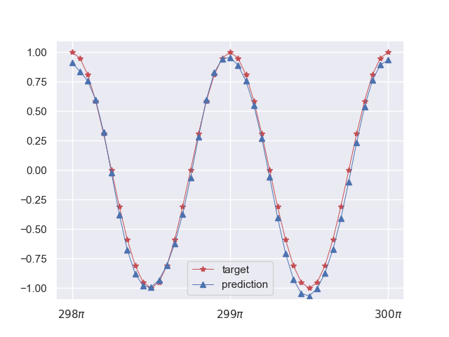

# PyDyNet：Neuron Network(DNN, CNN, RNN, etc) implementation using Numpy based on Autodiff

前作：[PyNet: Use NumPy to build neuron network](https://github.com/Kaslanarian/PyNet)。在那里我们基于求导规则实现了全连接网络。在这里，我们向当今的深度学习框架看齐，实现属于自己的DL框架。

**PyDyNet已被多个技术公众号和社区分享**：[居然用Numpy实现了一个深度学习框架](https://segmentfault.com/a/1190000042108301).

[](https://pepy.tech/project/pydynet)
[](https://pepy.tech/project/pydynet)


<details><summary>更新日志</summary>
<p>

- 5.10: ver 0.0.1 修改损失函数的定义方式：加入reduction机制，加入Embedding;
- 5.15: ver 0.0.2 重构了RNN, LSTM和GRU，支持双向;
- 5.16: ver 0.0.2 允许PyDyNet作为第三方库安装；开始手册的撰写(基于Sphinx).
- 5.29: ver 0.0.3 加入了Dataset和Dataloader，现在可以像PyTorch一样定义数据集和分割数据集，具体参考[data.py](/pydynet/data.py)中的`train_loader`函数；
- 5.30: ver 0.0.3 将一维卷积算法退化成基于循环的im2col，新版本NumPy似乎不是很支持strided上数组的魔改；
- 7.22: ver 0.0.4/0.05 增加了Module类和Parameter类，将模块重组、增加多种Pytorch支持的初始化方式；正在撰写新的Manual；
- 7.28: ver 0.0.6 加入no_grad方法，可以像pytorch一样禁止自动微分，比如`@no_grad()`和`with no_grad()`，详见[autograd.py](/pydynet/autograd.py);
- 8.09: ver 0.0.7 基于[cupy](https://cupy.dev/)，PyDyNet现在可以使用显卡加速训练，用法与PyTorch一致，详见[tests](./tests)中`cu*.py`；
- 8.18: ver 0.0.8 加入学习率调整策略，实现了训练过程中自动调节学习率；
- 10.21: ver 0.0.9 加入tensor的split方法，基于此改进了RNN；
- 10.23: ver 0.0.10 重写RNN, LSTM和GRU，支持多层双向；
- ...

</p>
</details>

## Overview

PyDyNet也是纯NumPy(0.0.7版本后加入CuPy，其用法和NumPy一致)实现的神经网络，语法受PyTorch的启发，大致结构如下：


虚线表示用户可以通过`no_grad`来关闭自动微分功能。

文件结构

```bash
pydynet
├── __init__.py
├── autograd.py       # 微分控制模块
├── cuda.py           # cuda功能模块
├── data.py           # 数据集模块
├── nn                # 神经网络模块
│   ├── __init__.py   
│   ├── functional.py # 函数类
│   ├── init.py       # 初始化模块
│   ├── modules
│   │   ├── __init__.py
│   │   ├── activation.py # 激活函数
│   │   ├── batchnorm.py  # BN
│   │   ├── conv.py       # 卷积
│   │   ├── dropout.py    # Dropout
│   │   ├── linear.py     # 线性层
│   │   ├── loss.py       # 损失函数类
│   │   ├── module.py     # Module基类，包括Sequential
│   │   ├── pool.py       # 池化
│   │   └── rnn.py        # RNN
│   └── parameter.py      # 参数化类
├── optim
│   ├── __init__.py
│   ├── lr_scheduler.py   # 学习率衰减策略
│   └── optimizer.py      # 优化器类
└── tensor.py             # 张量类
```

我们实现了：

1. 将NumPy数组包装成具有梯度等信息的张量(Tensor):
   <details><summary>Example</summary>
   <p>

   ```python
   from pydynet import Tensor

   x = Tensor(1., requires_grad=True)
   print(x.data) # 1.
   print(x.ndim, x.shape, x.is_leaf) # 0, (), True
   ```
   </p>
   </details>

2. 将NumPy数组的计算(包括数学运算、切片、形状变换等)抽象成基础算子(Basic operators)，并对部分运算加以重载：
   <details><summary>Example</summary>
   <p>

   ```python
   import pydynet as pdn
   from pydynet import Tensor

   x = Tensor([1, 2, 3])
   y = pdn.exp(x) + x
   z = pdn.sum(x)
   print(z.data) # 36.192...
   ```
   </p>
   </details>

3. 手动编写基础算子的梯度，实现和PyTorch相同的动态图自动微分机制(Autograd)，从而实现反向传播
   <details><summary>Example</summary>
   <p>

   ```python
   import pydynet as pdn
   from pydynet import Tensor

   x = Tensor([1., 2., 3.], requires_grad=True)
   y = pdn.log(x) + x
   z = pdn.sum(y)

   z.backward()
   print(x.grad) # [2., 1.5, 1.33333333]
   ```
   </p>
   </details>

4. 基于基础算子实现更高级的算子(Complex operators)，它们不再需要手动编写导数：
   <details><summary>Example</summary>
   <p>

   ```python
   import pydynet as pdn

   def simple_sigmoid(x: pdn.Tensor):
       return 1 / (1 + pdn.exp(-x))
   ```
   </p>
   </details>

5. 实现了Mudule，包括激活函数，损失函数等，从而我们可以像下面这样定义神经网络，损失函数项：
   <details><summary>Example</summary>
   <p>

   ```python
   import pydynet.nn as nn
   import pydynet.nn.functional as F

   n_input = 64
   n_hidden = 128
   n_output = 10

   class Net(nn.Module):
       def __init__(self) -> None:
           super().__init__()
           self.fc1 = nn.Linear(n_input, n_hidden)
           self.fc2 = nn.Linear(n_hidden, n_output)

       def forward(self, x):
           x = self.fc1(x)
           x = F.sigmoid(x)
           return self.fc2(x)

   net = Net()
   loss = nn.CrossEntropyLoss()
   l = loss(net(X), y)
   l.backward()
   ```
   </p>
   </details>

6. 实现了多种优化器和学习率衰减策略，从而实现神经网络的训练；其中优化器和PyTorch一样支持权值衰减，即正则化：
   <details><summary>Example</summary>
   <p>

   ```python
   from pydynet.optim import Adam, StepLR

   ...
   net = Net()
   optimizer = Adam(net.parameters(), lr=0.01)
   lr_scheduler = StepLR(optimizer, step_size=10)

   for epoch in range(EPOCHES):
       for data in data_loader:
           train(...)
           optimizer.step()
       lr_scheduler.step()
   ```
   </p>
   </details>
7. 实现了Dataset和DataLoader对数据集进行加载与划分：
   <details><summary>Example</summary>
   <p>

   ```python
   from pydynet.data import Dataset, DataLoader
   
   class TrainSet(Dataset):
       def __init__(self, X, y) -> None:
           self.data = X
           self.target = y

       def __getitem__(self, index):
           return self.data[index], self.target[index]

       def __len__(self):
           return len(self.data)

    data_loader = DataLoader(TrainSet(X, y), batch_size, shuffle)
   ```
   </p>
   </details>
8. Dropout机制，Batch Normalization机制，以及将网络划分成训练阶段和评估阶段；
9. 基于im2col高效实现Conv1d, Conv2d, max_pool1d和max_pool2d，从而实现CNN；
10. 支持多层的**多层双向**RNN，LSTM和GRU；
11. 多种初始化方式，包括Kaiming和Xavier；
12. 基于cupy实现了显卡计算和训练：
    <details><summary>Example</summary>
    <p>

    ```python
    from pydynet import Tensor
       
    x = Tensor([1., 2., 3.], device='cuda')
    y = Tensor([1., 2., 3.], device='cuda')
    z = (x * y).sum()

    w = Tensor([1., 2., 3.]) # CPU上的Tensor
    x * w # 报错
    ```
    </p>
    </details>

## Install

```bash
pip install pydynet
```

或本地安装

```bash
git clone https://github.com/Kaslanarian/PyDyNet
cd PyDyNet
python setup.py install
```

安装成功后就可以运行下面的例子

## Example

[tests](./tests)中是一些例子。

### AutoDiff

[autodiff.py](tests/autodiff.py)利用自动微分，对一个凸函数进行梯度下降：


### DNN

[DNN.py](tests/DNN.py)使用全连接网络对`sklearn`提供的数字数据集进行分类，训练参数

- 网络结构：Linear(64->64) + Sigmoid + Linear(64->10)；
- 损失函数：Cross Entropy Loss；
- 优化器：Adam(lr=0.01)；
- 训练轮次：50；
- 批大小(Batch size)：32.

训练损失，训练准确率和测试准确率：


### CNN

[CNN.py](tests/CNN.py)使用三种网络对`fetch_olivetti_faces`人脸(64×64)数据集进行分类并进行性能对比：

1. Linear + Sigmoid + Linear;
2. Conv1d + MaxPool1d + Linear + ReLU + Linear;
3. Conv2d + MaxPool2d + Linear + ReLU + Linear.

其余参数相同：

- 损失函数：Cross Entropy Loss；
- 优化器：Adam(lr=0.01)；
- 训练轮次：50；
- 批大小(Batch size)：32.

学习效果对比：


## Droput & BN

[dropout_BN.py](tests/dropout_BN.py)使用三种网络对`fetch_olivetti_faces`人脸(64×64)数据集进行分类并进行性能对比：

1. Linear + Sigmoid + Linear;
2. Linear + Dropout(0.05) + Sigmoid + Linear;
3. Linear + BN + Sigmoid + Linear.

其余参数相同：

- 损失函数：Cross Entropy Loss；
- 优化器：Adam(lr=0.01)；
- 训练轮次：50；
- 批大小(Batch size)：32.

学习效果对比：


## RNN

[RNN.py](tests/RNN.py)中是一个用双向单层GRU对`sklearn`的数字图片数据集进行分类：



## cuda相关

[cuDNN.py](tests/cuDNN.py), [cuCNN.py](tests/cuCNN.py), [cuDropoutBN.py](tests/cuDropoutBN.py), [cuRNN.py](tests/cuRNN.py)分别是上面四种网络的cuda版本，并对网络进行了相应的修改，主要是介绍如何使用PyDyNet的显卡功能，且已经在无显卡和有显卡的环境下都通过了测试。

|  Net  |         Dataset          |        Parameters        |   CPU time   |   GPU time   |
| :---: | :----------------------: | :----------------------: | :----------: | :----------: |
|  FC   |     Digits (1970×64)     | batch_size=128, epoch=50 | 30.8s±392ms  | 22.4s±298ms  |
| CNN1d | OlivettiFaces (400×4096) | batch_size=64, epoch=50  | 8.76s±68.7ms | 4.49s±16.3ms |
| CNN2d | OlivettiFaces (400×4096) | batch_size=64, epoch=50  | 14.1s±285ms  |  4.54s±49ms  |

事实上，对于越庞大的网络（更宽，更深，卷积），GPU加速效果更好。
